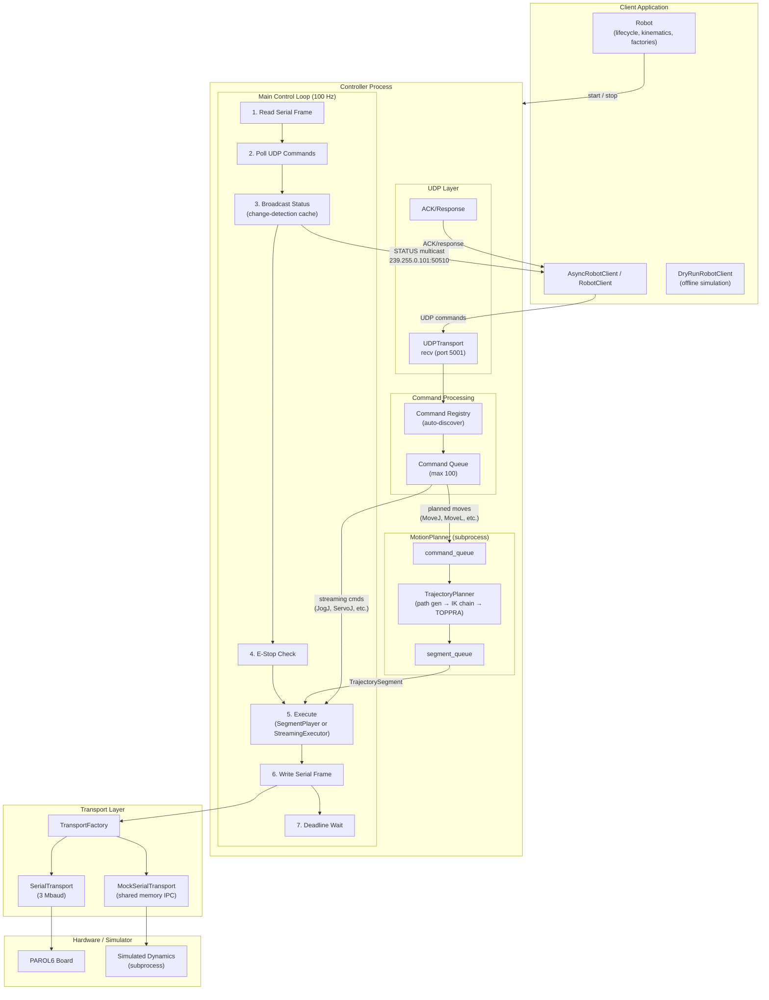

# PAROL6 Python API

Lightweight Python client and controller manager for PAROL6 robot arms.

This package provides:
- Robot (unified entry point — lifecycle, kinematics, client factories)
- AsyncRobotClient (async UDP client)
- RobotClient (sync wrapper around the async client)
- DryRunRobotClient (offline trajectory simulation)
- CLI `parol6-server` for standalone controller operation

It supports a controller process speaking a msgpack-based UDP protocol. The client can run on the same machine or remotely.

---

## Table of contents

- [Installation](#installation)
- [Quickstart](#quickstart)
- [Architecture overview](#architecture-overview)
- [Control loop internals](#control-loop-internals)
- [Hot path rules](#hot-path-rules)
- [Motion profiles](#motion-profiles)
- [Command system](#command-system)
- [Kinematics and tools](#kinematics-and-tools)
- [Environment variables](#environment-variables)
- [Development setup](#development-setup)
- [FAQ / Troubleshooting](#faq--troubleshooting)
- [Safety notes](#safety-notes)

---

## Installation
```bash
pip install .
```

To launch the controller after installation:

```bash
parol6-server --log-level=INFO
```

## Quickstart

### Using the Robot class
```python
from parol6 import Robot, RobotClient

robot = Robot(host="127.0.0.1", port=5001)
robot.start()  # starts controller subprocess, blocks until ready
try:
    with RobotClient(host="127.0.0.1", port=5001) as client:
        print("ping:", client.ping())
        print("pose:", client.get_pose())
finally:
    robot.stop()
```

The `Robot` class can also be used as a context manager:
```python
with Robot() as robot:
    with RobotClient() as client:
        client.home()
        client.wait_motion_complete()
```

### Async client
```python
import asyncio
from parol6 import AsyncRobotClient

async def main():
    async with AsyncRobotClient(host="127.0.0.1", port=5001) as client:
        ready = await client.wait_ready(timeout=3)
        print("server ready:", ready)
        print("ping:", await client.ping())
        status = await client.get_status()
        print("status keys:", list(status.keys()) if status else None)

asyncio.run(main())
```

### Sync client (convenience wrapper)
```python
from parol6 import RobotClient

with RobotClient(host="127.0.0.1", port=5001) as client:
    print("ping:", client.ping())
    print("pose:", client.get_pose())
```

## Architecture overview



### Component summary

- **Robot** (`parol6.robot`): Unified entry point — server lifecycle, kinematics (FK/IK), client factories, configuration
- **Client** (`parol6.client`): `AsyncRobotClient` (async UDP with built-in multicast status listener), `RobotClient` (sync wrapper), `DryRunRobotClient` (offline simulation)
- **Controller** (`parol6.server.controller`): Main loop with phase-based execution at 100 Hz, UDP command server, status broadcasting
- **MotionPlanner** (`parol6.server.motion_planner`): Separate subprocess for trajectory computation (TOPPRA, IK chains) — keeps the 100 Hz loop free. Only planned moves (MoveJ, MoveL, MoveC, MoveS, MoveP) go through the planner; streaming commands (JogJ, ServoJ, etc.) execute directly in the main loop
- **SegmentPlayer** (`parol6.server.segment_player`): Consumes computed trajectory segments in the control loop — indexes one waypoint per tick with zero allocation
- **StreamingExecutor** (`parol6.motion.streaming_executors`): Joint-space and Cartesian Ruckig-based executors for real-time jog/servo commands
- **Motion pipeline** (`parol6.motion`): Offline trajectory generation (TOPPRA, Ruckig, Quintic, Trapezoid, Linear) and online streaming executors
- **Transports** (`parol6.server.transports`): `SerialTransport` (hardware, 3 Mbaud), `MockSerialTransport` (simulator via shared memory IPC)
- **StatusCache** (`parol6.server.status_cache`): Change-detection cache with async IK worker for cartesian/joint enablement computation

### Why multicast status?

The controller pushes status via UDP multicast to avoid client-side polling, reduce command-channel contention, and support multiple observers (GUI, logging). Falls back to unicast when multicast is unavailable (`PAROL6_STATUS_TRANSPORT=UNICAST`).

### Simulator mode

Uses `MockSerialTransport` with shared memory IPC for subprocess isolation. Toggle via `simulator_on()` / `simulator_off()`. The simulator syncs to controller state on enable for pose continuity. **Note**: Simulation cannot guarantee hardware success—motor/current limits may cause failures on the real robot.

---

## Control loop internals

The main loop (`controller.py`) runs a fixed sequence of phases every tick:

1. **Read serial frame** — poll transport for incoming telemetry (position, I/O, gripper)
2. **Poll UDP commands** — non-blocking receive up to 25 messages per tick
3. **Broadcast status** — multicast at `STATUS_RATE_HZ` (default 50 Hz), skipped if status cache is stale
4. **E-Stop check** — hardware pin polling; on activation: cancel all motion, clear queue, send DISABLE to firmware. Auto-recovers on release
5. **Execute** — run SegmentPlayer (planned moves) or StreamingExecutor (jog/servo)
6. **Write serial frame** — pack output into 58-byte frame and transmit
7. **Deadline wait** — hybrid sleep + busy-loop to hit exact tick boundary

### Timing: hybrid sleep + busy-loop

The loop timer (`loop_timer.py`) uses a two-phase strategy for precise tick timing:

```
deadline = now + interval (10ms at 100Hz)

if time_remaining > busy_threshold (2ms):
    time.sleep(time_remaining - busy_threshold)    # OS sleep for bulk of wait

while time.perf_counter() < deadline:
    pass                                           # Busy-loop for final 2ms
```

OS `time.sleep()` has ~1-4ms jitter depending on platform and load. The busy-loop absorbs this jitter to hit deadline with sub-millisecond precision. The `PAROL6_BUSY_THRESHOLD_MS` env var (default 2) controls the crossover point.

### Planned vs streaming command paths

**Planned moves** (MoveJ, MoveL, MoveC, MoveS, MoveP, Home):
1. Command arrives via UDP → decoded → queued
2. Submitted to MotionPlanner subprocess via `command_queue`
3. Planner runs TrajectoryBuilder (TOPPRA, IK) — can take 10-500ms
4. Result sent back as `TrajectorySegment` via `segment_queue`
5. SegmentPlayer indexes one waypoint per tick: `Position_out[:] = trajectory_steps[step]`

**Streaming commands** (JogJ, JogL, ServoJ, ServoL):
1. Command arrives via UDP → **stream fast-path** (no full decode if type matches active command)
2. `assign_params()` updates target on existing command instance
3. `do_setup()` re-runs (also a hot path at ~50Hz for UI-driven jog)
4. StreamingExecutor ticks Ruckig for smooth interpolation
5. Per-tick IK solve for Cartesian commands (JogL, ServoL)

The fast-path avoids command object creation entirely — it reuses the active command instance and re-assigns parameters. This is critical for 50Hz jog streams.

## Hot path rules

The control loop and streaming command paths are latency-critical. GC pauses are the primary cause of loop timing degradation. The codebase enforces strict allocation discipline:

### Zero-allocation zones

`execute_step()` and `tick()` run at 100Hz. `do_setup()` for streamable commands runs at ~50Hz (UI sends at status rate). These are **zero heap allocation** zones:

- **No container construction**: No `list(...)`, `[x for x in ...]`, `dict(...)`, `set(...)`, or comprehensions
- **No string formatting**: No f-strings or `%` formatting (except error paths that run once)
- **No object creation**: No `dataclass()`, `namedtuple()`, or class instantiation
- **Pre-allocate all buffers in `__init__`**: numpy arrays, lists, memoryviews
- **In-place array ops**: `dest[:] = src` (numpy writes into existing buffer)
- **`np.copyto(dest, src, casting=...)` only when casting is needed** — it's slower than `dest[:] = src` otherwise

Pre-allocate all buffers in `__init__` and reuse them every tick via `dest[:] = src`. StreamingExecutor's `tick()` returns reused `list[float]` — callers must copy if they need values across ticks.

Performance-critical functions (unit conversions, serial frame packing, IK checks, SE3 ops, statistics) are Numba JIT-compiled with `@numba.njit(cache=True)`. First run takes 3-10s for compilation; `warmup_jit()` pre-compiles at startup. Subsequent runs use the cache (~100ms).

---

## Motion profiles

Set the motion profile for all moves:

```python
client.set_profile("TOPPRA")  # Default: time-optimal path-following
```

**Available profiles** (`SETPROFILE`):

| Profile | Description |
|---------|-------------|
| **TOPPRA** | Time-optimal path-following (default) |
| **RUCKIG** | Jerk-limited point-to-point motion (joint moves only) |
| **QUINTIC** | C² smooth polynomial trajectories |
| **TRAPEZOID** | Linear segments with parabolic blends |
| **LINEAR** | Direct interpolation (no smoothing) |

Note: RUCKIG is point-to-point only and cannot follow Cartesian paths. When RUCKIG is set, Cartesian moves automatically use TOPPRA instead.

### Speed and acceleration

```python
client.moveJ(target, speed=0.5, accel=0.5)   # 50% of joint limits
client.moveL(target, speed=0.25, accel=1.0)   # 25% cart speed, full accel
client.moveL(target, duration=2.0)             # Fixed duration (uses TOPPRA)
```

Speed and accel are fractions of maximum (0.0–1.0), not percentages.

For Cartesian moves, joint limits stay at 100% as hard bounds—the speed fraction only affects the Cartesian velocity constraint.

## Command system

Streaming mode (`client.stream_on()` / `client.stream_off()`) enables high-rate jogging — the server de-duplicates stale inputs, reduces ACK chatter, and reuses the active command fast-path. Use streaming for UI-driven jog or teleoperation; use non-streaming for discrete motions and queued programs.

### Command categories

| Category | Examples | Queue | ACK | Execution |
|----------|----------|-------|-----|-----------|
| **Query** | PING, GET_STATUS, GET_ANGLES | No | Request/response | Immediate |
| **System** | RESUME, HALT, SET_IO, SIMULATOR | No | Always | Immediate (even when disabled) |
| **Planned motion** | MOVEJ, MOVEL, MOVEC, MOVES, MOVEP, HOME | Yes | With command_index | MotionPlanner subprocess → SegmentPlayer |
| **Streaming motion** | JOGJ, JOGL, SERVOJ, SERVOL | Yes | Fire-and-forget | StreamingExecutor in main loop |
| **Utility** | DELAY, CHECKPOINT, SET_TOOL | Yes | With command_index | Inline via MotionPlanner (preserves ordering) |
| **Gripper** | PNEUMATICGRIPPER, ELECTRICGRIPPER | Yes | With command_index | Inline via MotionPlanner |

### Command lifecycle

All commands implement the `CommandBase` protocol:
- `setup(state)` → calls `do_setup(state)`: one-time preparation (trajectory computation, target resolution)
- `tick(state)` → calls `execute_step(state)`: per-tick execution in control loop, returns `EXECUTING`, `COMPLETED`, or `FAILED`
- `assign_params(params)`: for streamable commands, updates target without recreating the command

### Adding a new command

1. Create a class under `parol6/commands/` and decorate with `@register_command(CmdType.YOUR_CMD)`
2. Define a `PARAMS_TYPE` msgspec Struct for wire validation
3. Implement `do_setup(state)` and `execute_step(state)` — obey hot path rules
4. Set `streamable = True` if the command supports high-rate streaming
5. Add client method to `async_client.py` and `sync_client.py`

## Kinematics and tools

Uses numerical IK via pinokin (C++/Pinocchio bindings). Some Cartesian targets may fail to solve — J4 is particularly sensitive. To adapt to modified hardware, update `parol6/PAROL6_ROBOT.py` (gear ratios, limits) and `parol6/tools.py` (tool transforms).

Currently supported tools (see `parol6/tools.py`):
- `NONE` (bare flange)
- `PNEUMATIC` (pneumatic gripper)

Set tool at runtime from the client:
```python
from parol6 import RobotClient
with RobotClient() as c:
    c.set_tool("PNEUMATIC")
```

Add a new tool by extending `TOOL_CONFIGS` with a name, description, and `transform` (SE3 → 4×4 matrix).


**Security note:** The controller has no authentication — it accepts any correctly parsed command on its UDP port. Multiple senders are supported by design (e.g., GUI + orchestrator), but deploy only on trusted networks.

## Environment variables
- `PAROL6_CONTROL_RATE_HZ` — control loop frequency in Hz (default 100)
- `PAROL6_STATUS_RATE_HZ` — STATUS broadcast rate in Hz (default 50; tests use 20 Hz to reduce CI load)
- `PAROL6_STATUS_STALE_S` — skip broadcast if cache is older than this (default 0.2)
- `PAROL6_BUSY_THRESHOLD_MS` — busy-loop threshold for loop timing in ms (default 2)
- `PAROL6_PATH_SAMPLES` — trajectory path sampling points (default 50)
- `PAROL6_MAX_BLEND_LOOKAHEAD` — command blending lookahead count (default 3)
- `PAROL6_MCAST_GROUP` — multicast group for status (default 239.255.0.101)
- `PAROL6_MCAST_PORT` — multicast port for status (default 50510)
- `PAROL6_MCAST_TTL` — multicast TTL (default 1)
- `PAROL6_MCAST_IF` — interface/IP for multicast (default 127.0.0.1)
- `PAROL6_STATUS_TRANSPORT` — MULTICAST (default) or UNICAST
- `PAROL6_STATUS_UNICAST_HOST` — unicast target host (default 127.0.0.1)
- `PAROL6_CONTROLLER_IP` / `PAROL6_CONTROLLER_PORT` — bind host/port for controller
- `PAROL6_FORCE_ACK` — force ACK for motion commands regardless of policy
- `PAROL6_FAKE_SERIAL` — enable simulator ("1"/"true"/"on"); used internally by simulator_on/off
- `PAROL6_TX_KEEPALIVE_S` — TX keepalive period seconds for serial writes (default 0.2)
- `PAROL6_COM_FILE` — path to persistent COM port file (default `~/.parol6/com_port.txt`)
- `PAROL6_COM_PORT` / `PAROL6_SERIAL` — explicit serial port override (e.g., `/dev/ttyUSB0` or `COM3`)
- `PAROL_TRACE` — `1` enables TRACE logging level unless overridden by CLI


## Development setup

For contributors working on this repository:

```bash
pip install -e .[dev]
pre-commit install
```

- Run all pre-commit hooks locally: `pre-commit run -a`
- Run tests with pytest:
  - `pytest`
  - Simulator is used by default (PAROL6_FAKE_SERIAL=1).

### Control rate and performance

The default control loop rate is **100 Hz** (`PAROL6_CONTROL_RATE_HZ=100`). Higher rates up to 250 Hz and even 500 Hz are achievable, but there are diminishing returns in motion smoothness as you go higher.

Even under complete IK failure (worst-case computation), the control loop typically completes in **under 2ms**. However, consistent high-rate performance requires consideration of OS scheduling—the operating system commonly interrupts user-space processes, which can cause jitter at higher rates.

**Note:** Rates above 250 Hz may require increasing IK solving tolerance, as the distance moved per tick becomes smaller and numerical precision becomes a factor.

### Tuning for higher rates

For consistent high-rate performance:
1. **Elevate process priority**: On Linux, use `nice -n -20` or `chrt -f 50` for real-time scheduling
2. **Disable logging**: TRACE and DEBUG logging add significant overhead
3. **Reduce background load**: Heavy background tasks compete for CPU time
4. **Consider CPU isolation**: Pin the controller to dedicated cores with `taskset`


## FAQ / Troubleshooting
- I see `Control loop avg period degraded by …` warnings
  - The loop is falling behind. Reduce `PAROL6_CONTROL_RATE_HZ` and ensure TRACE and DEBUG logging is disabled.
- Motion feels inconsistent or jittery on my machine
  - Lower the control rate; avoid heavy background tasks; disable TRACE and DEBUG logging.
- Some cartesian targets fail to solve (especially around J4)
  - Without null-space control in the backend, some poses are hard to reach. Re-plan the path, adjust the target, or change the starting posture. Future backend updates may add null-space manipulation.


## Safety notes
- Keep physical E‑Stop accessible at all times when connected to hardware
- The controller can halt motion via `halt()` and reacts to E‑Stop inputs when on real hardware
- Prefer `simulator_on()` for development without hardware and validate motions before switching to real serial
